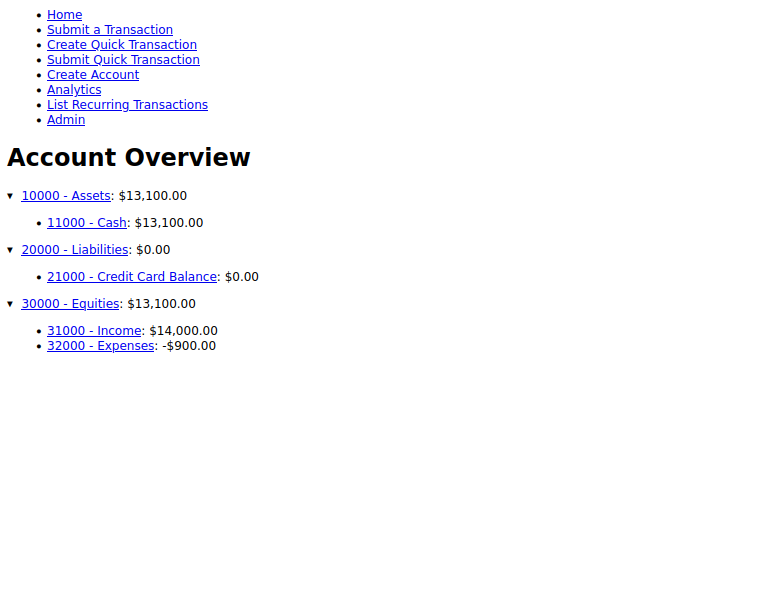
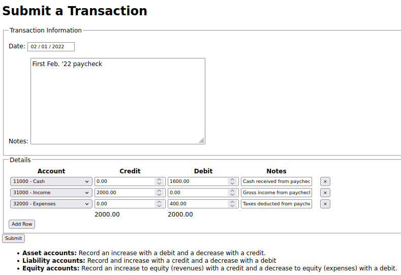
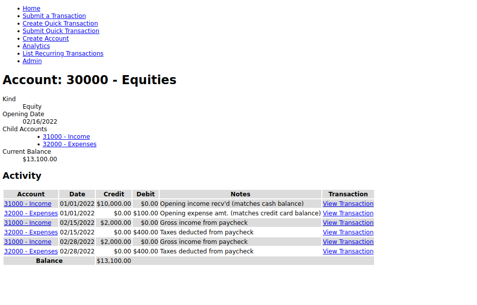

# Personal Finance Ledger App
Web-based application for tracking personal finances via double entry accounting.

## Setup
Below is an outline for loading some example data.
```
git clone <this-repository>
cd <folder-name>
# setup your python environment however you choose
...

# install requirements
pip install requirements.txt

# create database and run migrations
python manange.py migrate

# load the example fixture
python manage.py loaddata examples/fixtures/example.json

# run the server
python manage.py runserver

# optionally run with gunicorn instead
gunicorn budget.wsgi:application --bind localhost:8000

# go to localhost:8000 in your browser and explore
```

## Core Features
- Full customizability of accounts
- Accounting equation safeguards
- Recurring and quick transactions
- Reporting
- Create backups of ledger data (with `python manage.py backup`)

## Example Images
### Index Page


### Submitting a Transaction


### Account Detail


## Warning
This app is just for personal use and should not be deployed to a publicly-accessible server without major changes being done first.